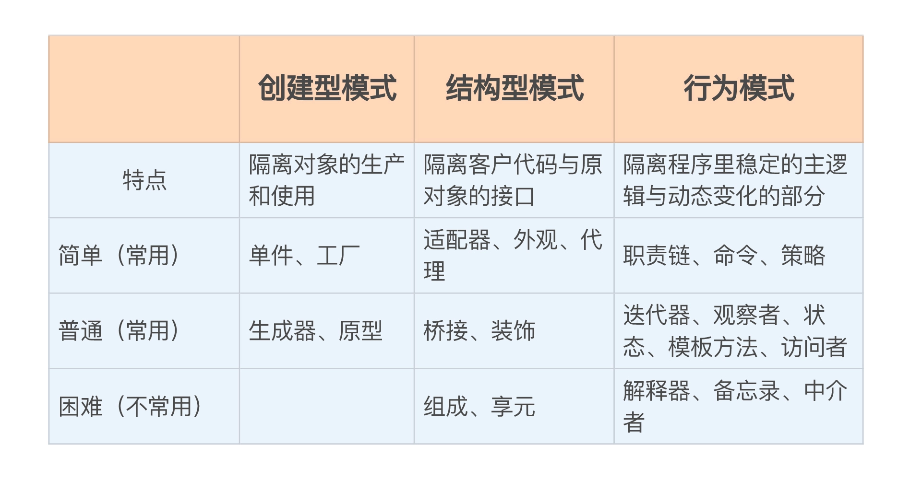

## 设计模式是什么？

**设计模式是对用来在特定场景解决一般设计问题的类和相互通信的对象的描述。**-- GOF

**设计模式**是软件设计中常见问题的典型解决方案。 它们就像能根据需求进行调整的预制蓝图， 可用于解决代码中反复出现的设计问题。

设计模式与方法或库的使用方式不同， 你很难直接在自己的程序中套用某个设计模式。 模式并不是一段特定的代码， 而是解决特定问题的一般性概念。 你可以根据模式来实现符合自己程序实际所需的解决方案。

人们常常会混淆模式和算法， 因为两者在概念上都是已知特定问题的典型解决方案。 但算法总是明确定义达成特定目标所需的一系列步骤， 而模式则是对解决方案的更高层次描述。 同一模式在两个不同程序中的实现代码可能会不一样。

算法更像是菜谱： 提供达成目标的明确步骤。 而模式更像是蓝图： 你可以看到最终的结果和模式的功能， 但需要自己确定实现步骤。

一般而言，一个模式有四个基本要素：
+ 模式名（pattern name）：助记名，描述模式的问题，解决方案和效果
+ 问题（problem）：描述应该在合适使用模式
+ 解决方案（solution）：描述设计的组成成分、他们之间的相互关系及各自的职责和协作方式
+ 效果（consequence）：描述模式应用的效果及使用模式应权衡的问题

## 设计模式分类

不同设计模式的复杂程度、 细节层次以及在整个系统中的应用范围等方面各不相同。 我喜欢将其类比于道路的建造： 如果你希望让十字路口更加安全， 那么可以安装一些交通信号灯， 或者修建包含行人地下通道在内的多层互通式立交桥。

最基础的、 底层的模式通常被称为惯用技巧。 这类模式一般只能在一种编程语言中使用。

最通用的、 高层的模式是构架模式。 开发者可以在任何编程语言中使用这类模式。 与其他模式不同， 它们可用于整个应用程序的架构设计。

此外， 所有模式可以根据其意图或目的来分类。 三种主要的模式类别：

-   **创建型模式**：提供创建对象的机制， 增加已有代码的灵活性和可复用性。
	- [工厂方法模式](工厂方法.md)(Factory Method Pattern)
	- [抽象工厂模式](抽象工厂.md)(Abstract Factory)
	- [建造者模式](生成器模式.md)（Builder）
	- [原型模式](原型模式.md)（Prototype）
	- 单例模式（Singleton）

-   **结构型模式**：介绍如何将对象和类组装成较大的结构， 并同时保持结构的灵活和高效。
	- [适配器模式](适配器模式.md)（Adapter）
	- [桥接模式](桥接模式.md)（Bridge）
	- [装饰模式](装饰模式.md)（Decorator）
	- [外观模式](外观模式.md)（Facade）
	- [享元模式](享元模式.md)（Flyweight）
	- [代理模式](代理模式.md)（Proxy）
-   **行为模式**：负责对象间的高效沟通和职责委派。
	- [职责链模式](职责链模式.md)（Chain of Responsibility）
	- 命令模式（Command）
	- 中介者模式（Mediator）
	- [观察者模式](观察者模式.md)（Observer）
	- [状态模式](状态模式.md)（State）
	- [策略模式](策略模式.md)（Strategy）
	- [模板方法模式](模板方法模式.md)（Template Method）
	- [访问者模式](访问者模式.md)（Visitor）

1. 创建型模式里常用的有单件和工厂，封装了对象的创建过程，隔离了对象的生产和使用；
2. 结构型模式里常用的有适配器、外观和代理，通过对象组合，得到一个新对象，目的是适配、简化或者控制，隔离了客户代码与原对象的接口；
3. 行为模式里常用的有职责链、命令和策略，只有在运行时才会建立联系，封装、隔离了程序里动态变化的那部分。

